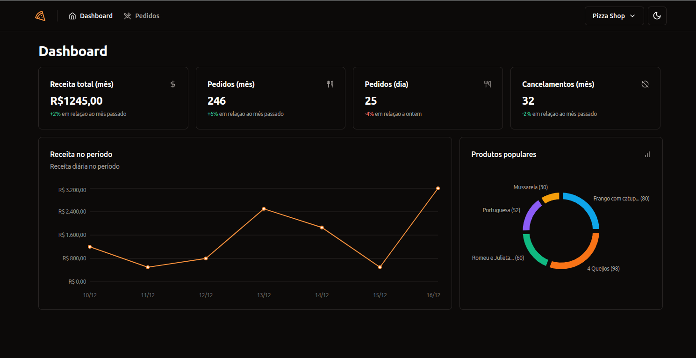
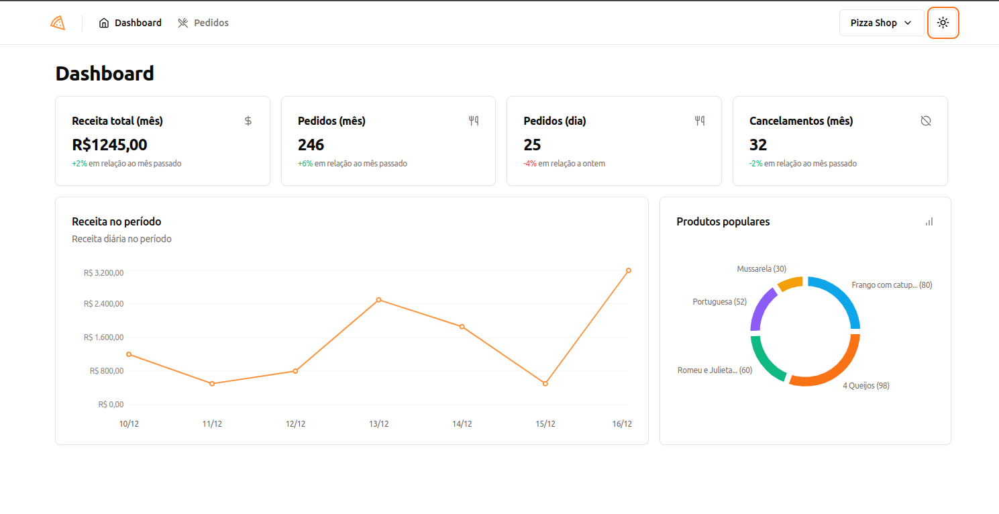

[](https://github.com/mauriciogirardi/pizza-shop/actions/workflows/ci.yml)

<div align="center">
  <h1>Dash food</h1>
</div>


This project has the intuition to create a Dashboard for food logists, the logist will be able to follow the metrics such as monthly orders and diaries and individually monitors each order and manages the status of the order

##### layout page dashboard




##### Main Technologies

| Technology           | Version |
|----------------------|---------|
| vite                 | 5.0.10  |
| react                | 18.2.0  |
| react-dom            | 18.2.0  |
| React-helmet-async   | 5.0.10  |
| tailwindcss          | 3.4.0   |
| typescript           | 5.2.2   |
| zod                  | 3.22.4  |
| recharts             | 2.10.3  |
| react-hook-form      | 7.49.2  |
| react-router-dom     | 6.21.1  |
| shadcn/ui            | 0.5.0   |
| pnpm                 | 8+      |
| node                 | 18+     |


##### How clone and run this project

```bash
# clone
git clone https://github.com/mauriciogirardi/pizza-shop.git

# open folder
cd pizza-shop

# install dependencies
pnpm install

# run
pnpm dev
```
----
[LICENSE](/LICENSE)
